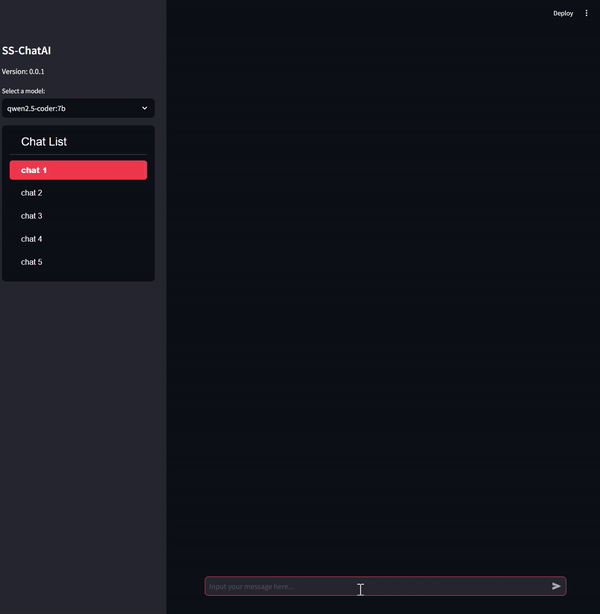

# SS-ChatAI

SS-ChatAI is a simple chat interface built using Streamlit and Ollama.

## Demo


## Features

- Support for multiple chat windows
- AI model integration through Ollama API
- User-friendly interface
- Streaming support for chat messages

## System Requirements

- Python 3.12
- Ollama server

## Installation

1. Clone the repository:
   ```
   git clone https://github.com/lazydok/ollama-streamlit-chat-ui.git
   ```

2. Navigate to the project directory:
   ```
   cd SS-ChatAI
   ```

3. Create and activate a virtual environment:
   ```
   python -m venv venv

   source venv/bin/activate (Ubuntu)
   venv/Scripts/activate.bat (Windows cmd)
   ```

4. Install the required packages:
   ```
   pip install -r requirements.txt
   ```

## Configuration

The `config.py` file contains important settings for the application. You can modify these settings to customize the behavior of SS-ChatAI:

- `MODELS`: List of available AI models
- `CHAT_WINDOWS`: List of chat window names
- `APP_TITLE`: Title of the application
- `OLLAMA_API_URL`: URL for the Ollama API

Adjust these values in `config.py` to match your requirements before running the application.

## Usage

1. Run the Ollama server.

2. Launch the application with the following command:
   ```
   streamlit run app.py
   ```

3. Access the displayed URL in your web browser.

## Contributing

If you'd like to contribute to the project, please send a pull request. For major changes, please open an issue first to discuss what you would like to change.

## License

This project is licensed under the [MIT License](LICENSE).